# Testing 
## New users Goals:
As a new user, I want to easily navigate through the website to find the activities that will help me with my language goals.
- The 'Study Activities' page is appropriately named for users wishing to find out about language learning activities.
- All the article cards have the name of the activity and the problem it helps fix in the title and image. 
- All articles have related articles in their table of content. 
- All language cards have a different colored Icon showing students the main focus of this activity (grammar, vocabulary, pronunciation, reading, writing, listening speaking) 
- The navigation bar is clearly defined and easily navigable for users to find and use.
- The logo image on the top left of each page leads users back to the home page.
- The footer menu is easy to use with appropriate icons for easy identification.

As a new user, I want to easily be able to identify the courses that are appropriate for my skill level.
- The 'Courses' page is easily found on each page, no matter the device.
- The 'Custom Study Timetable' is found on each page where students can sign up to the news letter where they will get activities that are exactly for their needs.
- The courses are labeled and easy to identify which level it is aimed at or the key benefit it provides. 

As a new user I want to a detailed description of the paid courses so I understand the material in the course. 
- The courses have a landing page (at this point only one) that breaks down why the course was created and the benefits of the course to the user. 
- The course landing page also has past user reviews that go into detail the benefits the user got from this course. 

# Current User 

As a current customer I want the ability to contact the company if I have any questions about the product I have bought 
- The contact page is easy to find and on all pages in the navigation. 

As a current customer I want a clear leaning path that I can progress on.
- The courses have been labeled based on the users level which will allow them to identify which is the next course they should take. 

# Manual Testing 

## Common Elements Testing 

Manual testing was conducted on the following elements that appear on every page and the most important elements of the website. 

Home Page responsive design + Navbar responsive

About page responsive design 

Blog page (study activities) responsive design

Contact page responsive design
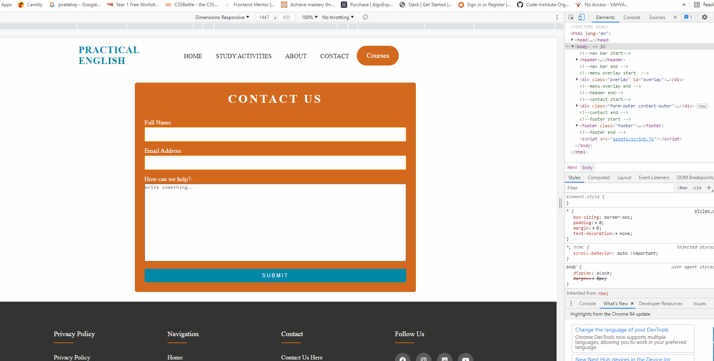

Article responsive design 

Landing page response design

# Automated Testing 

## Code Validation 

The W3C Markup Validator service was used to validate the HTML code used.

index page 
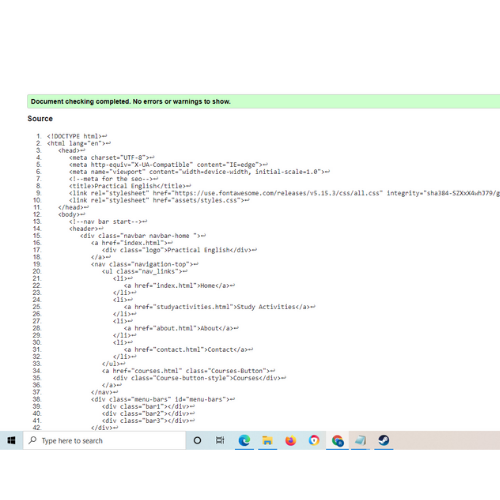

about page 
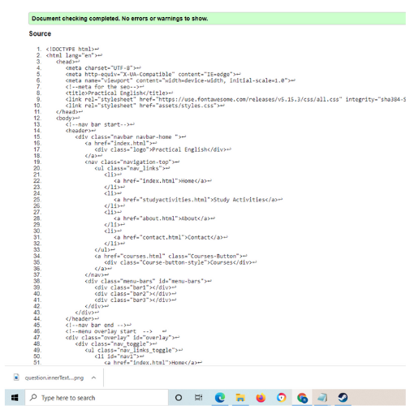

Article one
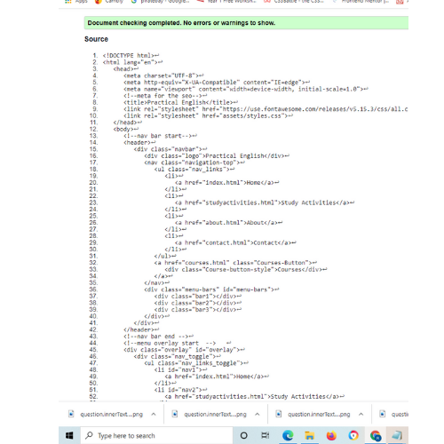

Article Two 
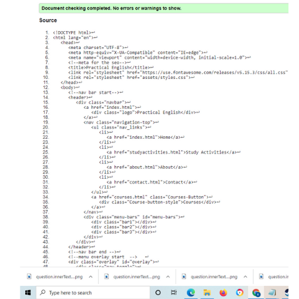

Article Three 
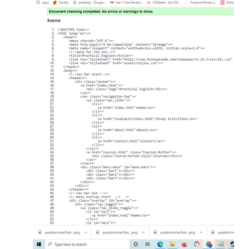

Article Four 
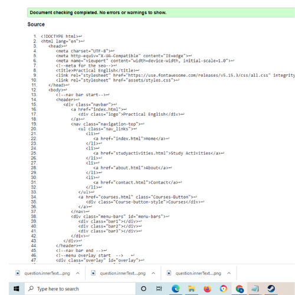

Article Five 
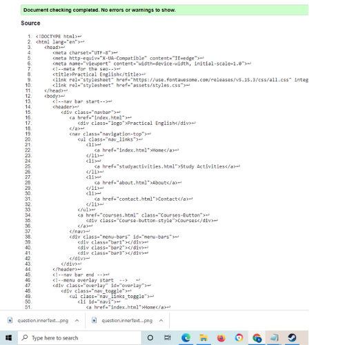

Article six 
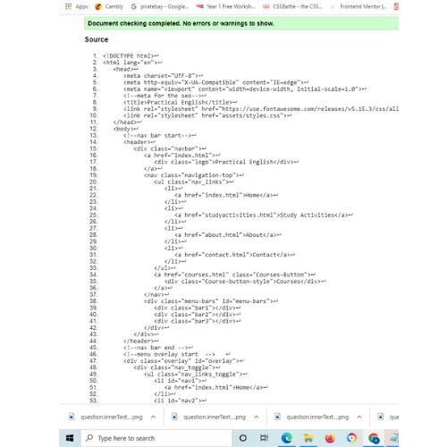

Coming Soon
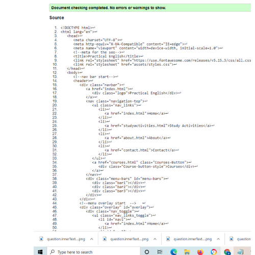

Contact 
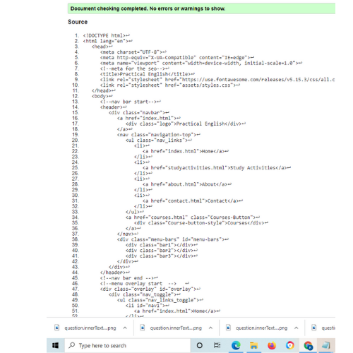

Courses 
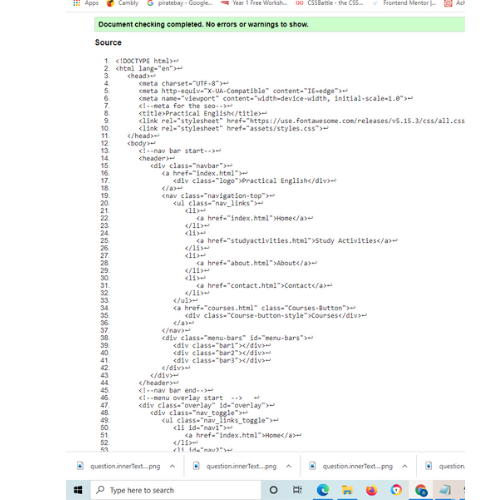

Landing page 
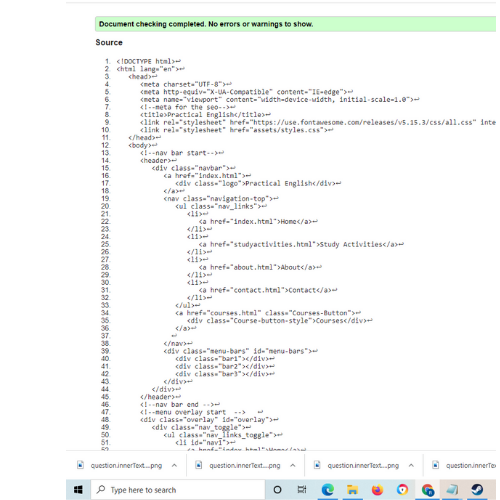

Study Activities 

